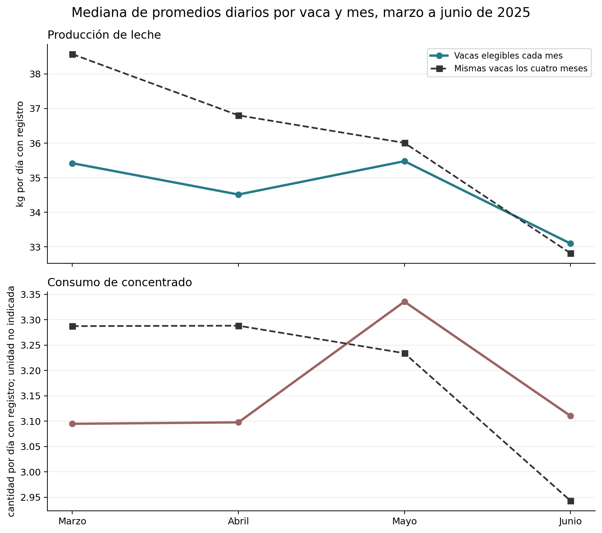
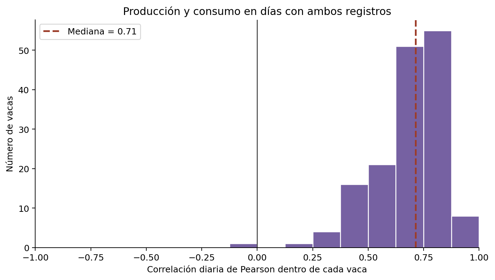
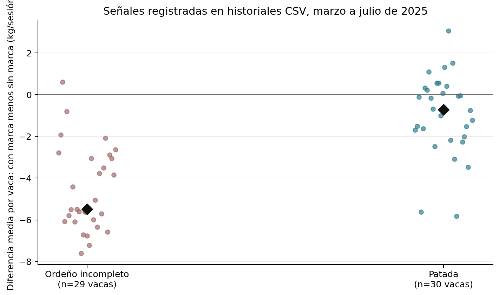

# Análisis de producción, consumo y eventos de ordeño

## Qué muestran los datos

El inventario comprende 442 archivos. Para el análisis numérico se leyeron los 201 libros de leche, los 203 de consumo y los historiales CSV de 34 vacas. Los tres CSV de resumen y el DOCX se describen en el [reporte estructural](reporte.md). Se comparó producción y consumo del **1 de marzo al 30 de junio de 2025**; los historiales CSV cubren marzo a julio de 2025. Las relaciones son descriptivas: no establecen que el alimento o las incidencias causen cambios en la producción.

En la cohorte de vacas con registros suficientes durante los cuatro meses, la mediana de producción diaria registrada pasó de **38.57 a 32.82 kg** entre marzo y junio (-14.9 %). La producción y el consumo diarios están positivamente asociados dentro de la mayoría de las vacas con días coincidentes. En los historiales CSV, las sesiones marcadas como incompletas presentan una producción menor dentro de la misma vaca. Estos resultados sugieren patrones a investigar con información de lactación, salud y manejo.

- Los Excel de producción contienen 278,968 eventos con fecha y producción numérica, entre 13/07/2022 y 28/01/2026. Los de consumo contienen 130,315 eventos con fecha y cantidad numérica, entre 28/01/2025 y 28/01/2026.
- En marzo a junio de 2025 hay 15,325 pares vaca-día con producción de 161 vacas y 15,381 pares vaca-día con consumo de 162 vacas identificables. Los días con ambos tipos de registro son 15,281, correspondientes a 161 vacas.
- Los historiales CSV contienen 7,249 eventos: 7,016 marcados como ordeño, 172 como rechazada y 61 como echada sin ordeñar.

## Producción y consumo por mes

Para cada vaca y mes se sumaron los eventos de cada día y después se calculó su promedio en días con registro. Sólo se incluyeron vacas con al menos 10 días registrados en ese mes. La cohorte fija exige ese mínimo en los cuatro meses; tiene 96 vacas en producción y 95 en consumo. Las medianas y los cuartiles se calculan entre vacas, de modo que una vaca con más sesiones no pesa más que otra.

### Leche

| Mes | Vacas elegibles | Mediana (kg/día registrado) | Q1–Q3 (kg/día registrado) | Mediana cohorte fija (kg/día registrado) |
|---|---:|---:|---:|---:|
| Marzo | 127 | 35.42 | 28.98–43.91 | 38.57 |
| Abril | 134 | 34.52 | 27.60–42.28 | 36.80 |
| Mayo | 126 | 35.48 | 29.42–43.38 | 36.01 |
| Junio | 138 | 33.10 | 27.07–39.46 | 32.82 |

### Concentrado

| Mes | Vacas elegibles | Mediana (cantidad/día registrado) | Q1–Q3 (cantidad/día registrado) | Mediana cohorte fija (cantidad/día registrado) |
|---|---:|---:|---:|---:|
| Marzo | 126 | 3.09 | 2.32–3.73 | 3.29 |
| Abril | 135 | 3.10 | 2.29–3.69 | 3.29 |
| Mayo | 127 | 3.34 | 2.66–3.77 | 3.23 |
| Junio | 139 | 3.11 | 2.27–3.63 | 2.94 |

El encabezado de consumo dice «Consumido», pero no declara unidad. Por ello los valores de concentrado se presentan en la **unidad original no especificada**, sin convertirlos a kilogramos ni calcular una razón de eficiencia leche/alimento. Las diferencias mensuales pueden reflejar cambios en lactación, composición de vacas, frecuencia de registro y manejo, además de cambios reales en producción o consumo.

## Relación entre consumo y producción

Se alinearon los totales diarios por ID de vaca y fecha en marzo a junio de 2025. Para cada vaca con al menos 20 días coincidentes se calculó la correlación de Pearson entre sus propios días; 157 vacas cumplieron el criterio. La mediana de estas correlaciones es **0.71**; 156 son positivas y 1 negativas. La distribución entre vacas es más informativa que una sola correlación agrupada, porque evita mezclar directamente vacas con distintos niveles habituales.

La correlación sólo describe coincidencia diaria. El cálculo dentro de cada vaca no elimina tendencias compartidas a lo largo de los meses. No ajusta por etapa de lactación, gestación, salud, ración distinta de concentrado ni retrasos entre alimentación y producción. Tampoco demuestra causalidad.

## Señales en los historiales de ordeño

Entre 7,012 sesiones marcadas como «Ordeño» con producción positiva, 1,011 (14.4 %) tienen marca de ordeño incompleto, 1,299 (18.5 %) tienen marca de patada y 1,235 (17.6 %) tienen marca de pezones no encontrados. Las marcas pueden coincidir en una sesión; sus porcentajes no se suman.

Para evitar comparar vacas de productividad distinta, se calculó dentro de cada vaca la producción media de sesiones con marca menos la media de sesiones sin marca. Sólo entraron vacas con al menos tres sesiones de cada clase. La mediana de las diferencias es **-5.49 kg/sesión** para ordeño incompleto (29 vacas) y **-0.72 kg/sesión** para patada (30 vacas). Un valor negativo indica menor producción observada en las sesiones marcadas.

Estas comparaciones no controlan duración, hora, intervalo desde el ordeño anterior ni estado del animal. Las marcas pueden ser consecuencia de la misma dificultad de ordeño y no su causa. El campo RCS tiene valor en 0 de las 7,012 sesiones válidas (0.0 %), lo que limita su uso para inferencias de salud de ubre.

## Calidad y límites de interpretación

- Se procesaron 201 libros de leche y 203 de consumo. En leche, 0 filas no aportaron simultáneamente fecha y producción numérica; en consumo fueron 0. Hubo 165 producciones y 0 consumos con valor cero o negativo, incluidos en los totales diarios cuando tenían fecha válida.
- En consumo, «Consumido» y «Consumido Mat. Seca» son iguales en 130,315 de 130,315 filas con ambas cifras (100.0 %). No se asumió que la segunda columna aporte una medida independiente.
- El archivo Concentrado consumido.xlsx no tiene ID en el nombre. Sus 106 eventos del periodo de estudio se excluyeron de resultados por vaca y de la asociación con leche.
- Un día sin registro no equivale a producción o consumo cero. Los promedios se calculan sólo sobre días observados. Las diferencias de cobertura entre fuentes pueden sesgar comparaciones.
- Los Excel abarcan un periodo mayor que el indicado por el nombre de la carpeta CSV. Los resultados mensuales de este reporte se limitan deliberadamente a marzo a junio de 2025. El [reporte estructural](reporte.md) documenta formatos, encabezados y coincidencias de ID.

## Reproducción

Ejecutar python3 analizar_datos.py desde esta carpeta. El script sólo lee los originales y regenera este reporte y tres gráficos PNG con Python, numpy, openpyxl y matplotlib. Se requiere un entorno con esas bibliotecas instaladas.
