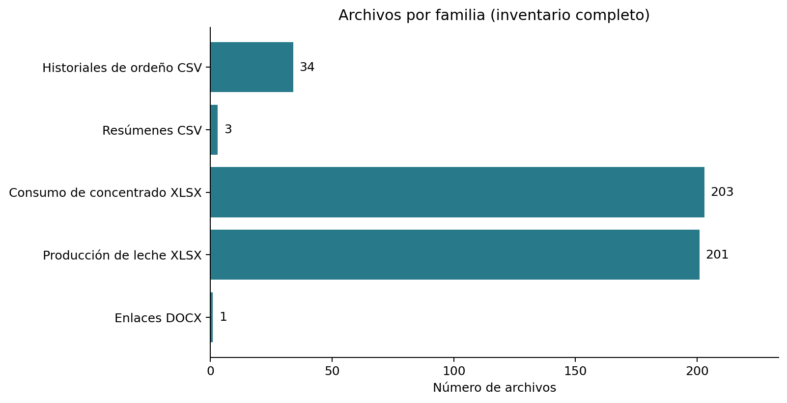
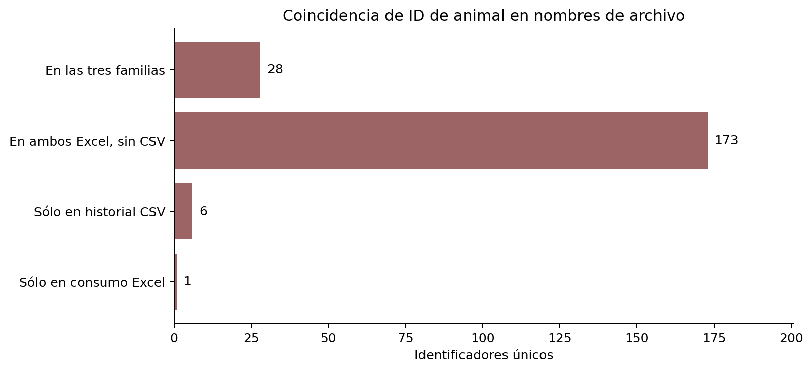
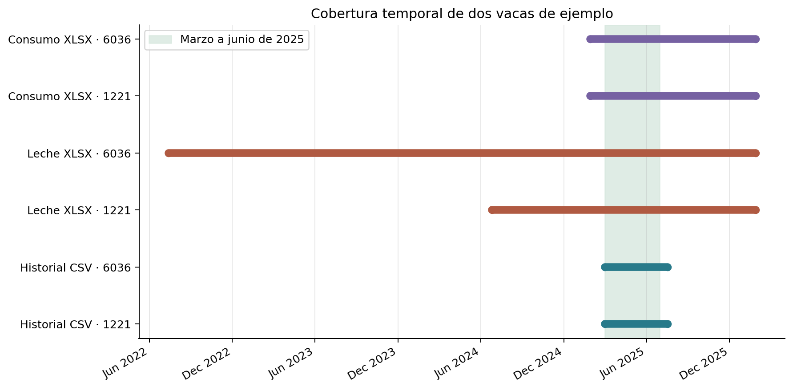

# Descripción general de los datos de vacas

## Alcance y método

Se revisaron las carpetas Datos/DATOS vacas en establo marzo_junio_2025 y Datos/TEC-UAQ-UNAM sin alterar los originales. Los conteos de archivos, tamaños y coincidencias de identificadores provienen del **inventario completo de archivos y sus metadatos**. Las columnas, registros y fechas descritos provienen únicamente de los archivos examinados en la tabla de muestras y de los tres CSV de resumen. No se infieren estadísticas de todo el hato a partir de ellos.

El script que acompaña este reporte, generar_reporte.py, reproduce el inventario y los gráficos con Python, openpyxl y matplotlib. Se ejecuta desde cualquier directorio con: python3 /ruta/al/proyecto/analisis_descriptivo_datos_vacas/generar_reporte.py.

## Inventario completo

| Familia | Archivos | Función aparente |
|---|---:|---|
| Historiales de ordeño CSV por ID | 34 | Eventos de ordeño de una vaca por archivo |
| CSV de resumen | 3 | Vistas transversales de animales |
| Consumo de concentrado XLSX | 203 | Eventos de alimento de una vaca por archivo, salvo uno sin ID |
| Producción de leche XLSX | 201 | Sesiones de ordeño de una vaca por archivo |
| DOCX de enlaces | 1 | Referencia a imágenes externas |
| **Total** | **442** | **61.7 MiB aproximadamente** |

Hay **34** ID en los nombres de historiales CSV, **201** en producción de leche y **202** identificables en consumo. El solapamiento es de **28** ID en las tres familias y **173** en los dos Excel sin historial CSV. Hay **6** sólo en historiales CSV (1204, 1554, 1613, 6194, 6211, 8712) y **1** sólo en consumo (216). Un libro de consumo adicional carece de ID en el nombre y no se asignó a ninguna vaca.

## Organización de los archivos

| Familia | Estructura observada | Variables principales |
|---|---|---|
| Historial CSV individual | UTF-8 con BOM, comas, 2 filas de encabezado; 35 columnas en los ejemplos | Inicio, acción, duración, producción en kg, número de ordeño, RCS, patada, ordeño incompleto, pezones no encontrados, medidas por cuarto y destino de la leche |
| patadas_180725.csv | Comas, 1 fila de encabezado; 43 columnas | ID, días en leche (DEL), último ordeño, patadas por cuarto, MDI, RCS, CMT y notas |
| inventario_total_180725.csv | Punto y coma, 1 fila de encabezado; 41 columnas | ID, grupo, reproducción, edad, lactación, alimento, producción y parentesco |
| reporte_180725.csv | Punto y coma, 1 fila de encabezado; 22 columnas | ID, grupo, reproducción, ordeño, actividad y días desde eventos |
| Consumo XLSX individual | Una hoja llamada Sheet; 1 fila de encabezado y 4 columnas | Alimento, hora del evento, consumido y consumido en materia seca |
| Producción XLSX individual | Una hoja llamada Sheet; 2 filas de encabezado y 42 columnas | Hora, sesión, duración, kg producidos, intervalos, medidas por cuarto, estado y destino |

DI, DD, TI y TD aparecen repetidas para distintos bloques de medidas de los cuartos de la ubre. Para analizarlas hay que conservar la fila superior del encabezado o construir nombres únicos. El significado exacto de abreviaturas como MDI, OCC, EO/PO y CMT requiere un diccionario del sistema de origen.

Los CSV transversales tienen 37 registros en patadas, 33 en inventario y 34 en reporte. En cada uno hay un registro por ID de animal, sin ID repetidos dentro del archivo. Son tres vistas con conjuntos de animales potencialmente diferentes; no deben concatenarse como si compartieran el mismo esquema.

## Fechas y tamaño de los ejemplos examinados

La selección incluye cuatro historiales CSV (1204.csv, 1221.csv, 1613.csv, 6036.csv), tres libros de consumo y tres de producción. Se eligieron ID compartidos (1221 y 6036) para poder comparar cobertura, además de ejemplos con distinta extensión temporal. Los tres CSV de resumen también se revisaron completos, pues son pequeños.

| Archivo examinado | Registros | Columnas | Fechas observadas |
|---|---:|---:|---|
| 1204.csv | 259 | 35 | 01/03/2025 a 18/07/2025 |
| 1221.csv | 162 | 35 | 01/03/2025 a 18/07/2025 |
| 1613.csv | 421 | 35 | 01/03/2025 a 18/07/2025 |
| 6036.csv | 410 | 35 | 01/03/2025 a 18/07/2025 |
| Concentrado consumido 1221.xlsx | 783 | 4 | 28/01/2025 a 28/01/2026 |
| Concentrado consumido 6036.xlsx | 1,037 | 4 | 28/01/2025 a 28/01/2026 |
| Concentrado consumido 2141.xlsx | 902 | 4 | 10/04/2025 a 28/01/2026 |
| Producciones de leche por sesiขn 1221.xlsx | 1,264 | 42 | 25/06/2024 a 28/01/2026 |
| Producciones de leche por sesiขn 6036.xlsx | 3,062 | 42 | 13/07/2022 a 28/01/2026 |
| Producciones de leche por sesiขn 1522.xlsx | 116 | 42 | 21/11/2025 a 28/01/2026 |

Las barras unen la primera y última fecha encontrada en cada archivo; no indican que haya registros todos los días. En los ejemplos, los historiales CSV abarcan marzo a julio de 2025, mientras que los Excel examinados llegan hasta enero de 2026 y un libro de producción empieza en 2022. **La etiqueta marzo_junio_2025 no describe todo el periodo observado.** Esta conclusión se refiere a los archivos examinados; no se calculó un mínimo o máximo para los 404 Excel.

## Calidad e integración

- El separador de inventario_total_180725.csv y reporte_180725.csv es punto y coma. Leerlos con coma divide erróneamente valores como 1,091 o textos que contienen comas.
- Los encabezados de los historiales CSV y de los Excel de producción ocupan dos filas. Varias etiquetas se repiten dentro de bloques distintos.
- Los nombres irregulares de consumo son: Concentrado consumido.xlsx, Concentrado consumido1224.xlsx, Concentrado consumido2145.xlsx. Dos tienen ID sin espacio antes del número y uno no tiene ID. El nombre de los libros de producción contiene literalmente la secuencia «sesiขn», indicio de una anomalía de codificación en el nombre.
- Los ID coincidentes en nombres son una clave posible de integración, pero conviene verificar la fecha, la unidad de registro y el significado de las medidas antes de unir eventos.
- Las columnas de resumen incluyen etiquetas repetidas, como «Fecha de parto esperada» y «Edad (a:mm)» en inventario. Su posición debe conservarse al preparar datos.

## Documento de enlaces

El DOCX contiene el texto «Links a imágenes: / Multi» y **1** hipervínculo(s). Enlace detectado:

- https://tecmx-my.sharepoint.com/:f:/g/personal/ivo_ayala_tec_mx/EgQaUtYXiOhDjbty20RbPEsBJqyFLWaGgqO-zsNLBkUZag?e=alvYV3

No se inspeccionó el contenido remoto del enlace; por ello no se describen imágenes ni se atribuyen características a ellas.

## Archivos incluidos en esta carpeta

- reporte.md: hallazgos y gráficos.
- generar_reporte.py: código reproducible; sólo lee las dos carpetas originales.
- graficos/: tres imágenes PNG generadas por el script.
